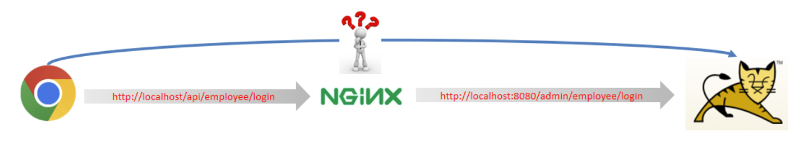
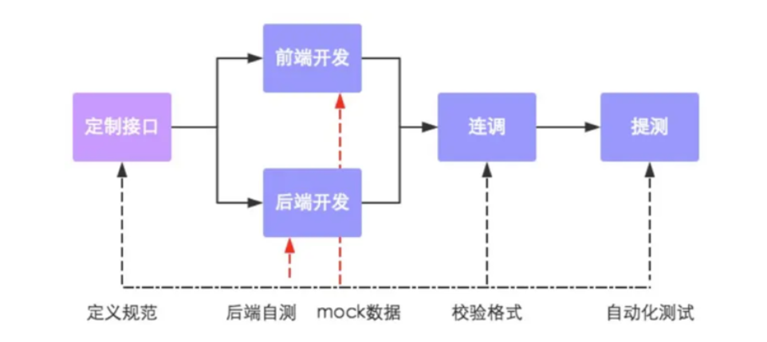

# 后端环境搭建

## Nginx 反向代理与负载均衡

在搭建环境对登录功能测试时，前端发送的请求地址是：http://localhost/api/employee/login，而后端的接口地址却是：http://localhost:8080/admin/employee/login，两个地址明显不一致，请求是怎么到达后端服务的？



### 1. 反向代理

反向代理就是：将前端的动态请求通过 nginx 转发到后端服务器。

为什么不直接通过浏览器请求后端服务器？反向代理的好处：

* 提高访问速度：nginx 本身可以缓存数据，如果访问同一接口，并且实现了数据缓存，nginx 就可以直接返回数据，不需要真正访问服务端，进而提高访问速度。
* 进行负载均衡：即大量请求按照指定方式均衡的分配个服务器集群中的每台服务器
* 保证后台服务器安全

实现中，http://localhost/api/employee/login 转发到 http://localhost:8080/admin/employee/login 的配置方式：

```nginx
server{
    listen 80;
    server_name localhost; 
    
    location /api/{
        proxy_pass http://localhost:8080/admin/; #反向代理
    }
}
```

**proxy_pass：**该指令是用来设置代理服务器的地址，可以是主机名称，IP地址加端口号等形式。

如上代码的含义是：监听80端口号， 然后当我们访问 http://localhost:80/api/../..这样的接口的时候，它会通过 location /api/ {} 这样的反向代理到 http://localhost:8080/admin/.../...上来。

### 2. 负载均衡

当如果服务以集群的方式进行部署时，那nginx在转发请求到服务器时就需要做相应的负载均衡。其实，负载均衡从本质上来说也是基于反向代理来实现的，最终都是转发请求。

nginx 负载均衡的配置方式：

```nginx
upstream webservers{
    server 192.168.100.128:8080;
    server 192.168.100.129:8080;
}
server{
    listen 80;
    server_name localhost;
    
    location /api/{
        proxy_pass http://webservers/admin;#负载均衡
    }
}
```

**upstream：**如果代理服务器是一组服务器的话，我们可以使用upstream指令配置后端服务器组。

如上代码的含义是：监听80端口号， 然后当我们访问 http://localhost:80/api/../..这样的接口的时候，它会通过 location /api/ {} 这样的反向代理到 http://webservers/admin，根据webservers名称找到一组服务器，根据设置的负载均衡策略(默认是轮询)转发到具体的服务器。

**注：**upstream后面的名称可自定义，但要上下保持一致。

**nginx 负载均衡策略：**

| **名称**   | **说明**                                               |
| ---------- | ------------------------------------------------------ |
| 轮询       | 默认方式                                               |
| weight     | 权重方式，默认为1，权重越高，被分配的客户端请求就越多  |
| ip_hash    | 依据ip分配方式，这样每个访客可以固定访问一个后端服务   |
| least_conn | 依据最少连接方式，把请求优先分配给连接数少的后端服务   |
| url_hash   | 依据url分配方式，这样相同的url会被分配到同一个后端服务 |
| fair       | 依据响应时间方式，响应时间短的服务将会被优先分配       |

具体配置方式：

**轮询：**

```nginx
upstream webservers{
    server 192.168.100.128:8080;
    server 192.168.100.129:8080;
}
```

**weight:**

```nginx
upstream webservers{
    server 192.168.100.128:8080 weight=90;
    server 192.168.100.129:8080 weight=10;
}
```

**ip_hash:**

```nginx
upstream webservers{
    ip_hash;
    server 192.168.100.128:8080;
    server 192.168.100.129:8080;
}
```

**least_conn:**

```nginx
upstream webservers{
    least_conn;
    server 192.168.100.128:8080;
    server 192.168.100.129:8080;
}
```

**url_hash:**

```nginx
upstream webservers{
    hash &request_uri;
    server 192.168.100.128:8080;
    server 192.168.100.129:8080;
}
```

**fair:**

```nginx
upstream webservers{
    server 192.168.100.128:8080;
    server 192.168.100.129:8080;
    fair;
}
```

## 登录功能

1. 首先根据请求参数，创建对应的 DTO：

```java
@Data
@ApiModel(description = "员工登录时传递的数据")
public class EmployeeLoginDTO implements Serializable {

    @ApiModelProperty("用户名")
    private String username;

    @ApiModelProperty("密码")
    private String password;

}
```

2. 创建相应的 Controller、Service、Mapper：

* controller 调用 service
* service 调用 mapper 根据 username 取出 employee，如果 employee 为空，说明用户不存在，不为空，取出对应的密码，与请求传递的密码比对，并且还要判断当前用户状态是否处于禁用

3. 由于 Http 是无状态请求，为了保留当前验证结果，引入会话技术，会话技术中有 cookie、session、以及 JWT 令牌，根据实际情况这里选择了 JWT 令牌，这时就需要 service 层返回 username 对应的实体 employee，将对象相关信息存入 JWT 载荷，生成 JWT 令牌，返回给前端。
4. JWT 令牌的生成需要三个部分：载荷、密钥、过期时间。生成时需要指定加密算法、设置生成的时间、然后通过调用 `Jwts.builder()` 来生成 `JwtBuilder` 对象，需要先设置私有声名，再设置签名算法与指定的密钥、过期时间。
5. 最后返回 JWT Token

> 注意：数据库员工表中密码明文存储安全性太低，将密码通过 MD5 加密后存储提升安全性。
>
> 这意味着通过 username 拿到的密码是加密后的密码，需要将传递的明文密码加密后再与数据库中的密码比对。

## 接口文档

由于模拟的是先后端分离的开发方式，所以需要通过接口文档来指导前后端并行开发。实际的开发流程如下：



可以通过将接口文档导入 YApi 进行统一管理，完成了一个接口的开发，就可以在 YApi 中标明该接口已完成。

## Swagger

自动在线生成 RESTful 风格的 Web 服务接口文档的的框架，knife4j 是为 Java MVC 框架集成 Swagger 生成 Api 文档的增强解决方案，取名 knife4j 是希望它能像一把匕首一样小巧，轻量并且功能强悍!

### 使用步骤

1. 导入 knife4j 的 maven 坐标
2. 在配置类中加入 knife4j 相关配置

```java
//WebMvcConfiguration.java
/**
     * 通过knife4j生成接口文档
     * @return
*/
    @Bean
    public Docket docket() {
        ApiInfo apiInfo = new ApiInfoBuilder()
                .title("苍穹外卖项目接口文档")
                .version("2.0")
                .description("苍穹外卖项目接口文档")
                .build();
        Docket docket = new Docket(DocumentationType.SWAGGER_2)
                .apiInfo(apiInfo)
                .select()
                .apis(RequestHandlerSelectors.basePackage("com.sky.controller"))
                .paths(PathSelectors.any())
                .build();
        return docket;
    }
```

3. 设置静态资源映射，否则接口文档无法访问

```java
// WebMvcConfiguration.java
protected void addResourceHandlers(ResourceHandlerRegistry registry) {
        registry.addResourceHandler("/doc.html").addResourceLocations("classpath:/META-INF/resources/");
        registry.addResourceHandler("/webjars/**").addResourceLocations("classpath:/META-INF/resources/webjars/");
}
```

4. 访问：http://localhost:8080/doc.html

> 思考：通过 swagger 就可以生成接口文档了，为什么还需要 Yapi？
>
> 1、Yapi 是设计阶段使用的工具，管理和维护接口
>
> 2、Swagger 在开发阶段使用的框架，帮助后端开发人员做后端的接口测试

### 常用注解

通过注解可以控制生成的接口文档，使接口文档拥有更好的可读性，常用注解如下：

| **注解**          | **说明**                                               |
| ----------------- | ------------------------------------------------------ |
| @Api              | 用在类上，例如Controller，表示对类的说明               |
| @ApiModel         | 用在类上，例如entity、DTO、VO                          |
| @ApiModelProperty | 用在属性上，描述属性信息                               |
| @ApiOperation     | 用在方法上，例如Controller的方法，说明方法的用途、作用 |

-----------------

# 员工模块开发

模块的开发需要基于接口，而接口的设计是通过分析产品原型实现的。

分析产品原型需要考虑数据的合法性（约束条件）、默认值、唯一性等等

接口设计需要明确**请求路径、请求方式、请求参数、返回数据**。

接口设计后，需要进行表结构设计，表结构设计时就需要考虑各个字段的约束条件。

各个功能开发模式：

1. **根据接口设计对应的DTO**：对比前端传递参数列表与实体类，当提交的数据与实体类中对应的属性差别较大时，需要使用 DTO 封装数据。

2. Controller 层
3. Service 层接口
4. Service 层实现类
5. Mapper 层接口与配置文件
6. 测试

## 新增员工

1. **根据新增员工接口设计对应的DTO**：封装 `EmployeeDTO` 类用来接收前端参数（@RequestBody 用于将请求参数为 json 格式的数据封装进 java 对象）

2. Controller 层：返回的结果要抽象出来，即 Result 类，通常包含 code、msg、data
3. Service 层接口
4. Service 层实现类：通过 `Beanutils.copyProperties()` 方法，将 DTO 中数据拷贝到要插入的 Employee， 并设置属性值的默认值、数据库信息（创建时间、创建人、修改时间、修改人）

> 注意：将默认值封装为常量类中的常量，避免出现硬编码

5. Mapper 层接口与配置文件：在配置文件中开启 mybatis 的驼峰命名，使 create_time 与 createTime 匹配
6. 测试：之前提到由于 Http 请求是无状态的，所以为了记录用户登录成功这个状态，用到了 JWT 令牌。登录成功后，后端将生成的 JWT 令牌返回给前端，此项目中命名为了 token，后续登录成功后的用户发起的所有请求都将在请求头中，携带 token。所以，这里的测试，需要先验证该用户是否合法。验证这个操作用到了拦截器。

#### 拦截器的使用

首先拦截器是一个 bean 类，需要交给 Spring 容器管理，它需要实现 `HandlerInterceptor` 接口，验证用户身份是否合法，需要在操作前，所以重写 preHandle 方法：

```java
  public boolean preHandle(HttpServletRequest request, HttpServletResponse response, Object handler) throws Exception {
        //判断当前拦截到的是Controller的方法还是其他资源
        if (!(handler instanceof HandlerMethod)) {
            //当前拦截到的不是动态方法，直接放行
            return true;
        }

        //1、从请求头中获取令牌 jwtProperties.getAdminTokenName()获取为token
        String token = request.getHeader(jwtProperties.getAdminTokenName());

        //2、校验令牌
        try {
            log.info("jwt校验:{}", token);
            Claims claims = JwtUtil.parseJWT(jwtProperties.getAdminSecretKey(), token);
            Long empId = Long.valueOf(claims.get(JwtClaimsConstant.EMP_ID).toString());
            log.info("当前员工id：", empId);
            //3、通过，放行
            return true;
        } catch (Exception ex) {
            //4、不通过，响应401状态码
            response.setStatus(401);
            return false;
        }
    }
```

在 JWT 令牌的解析过程中会调用 Jwt.parser() 方法得到解析对象，然后通过设置前面密钥，需要解析的 jwt 来实现解析，如果不合法会抛出异常。解析后，可以从载荷中取出当前操作用户的 ID，并将它放入 Threadlocal 用于后续维护数据库表中修改人、创建人 id 字段。

> 注意：由于用户名的唯一性，在插入重复的用户名时会抛出异常，而这个异常没有处理（返回给前端）

#### 全局异常处理器

通过全局异常处理器处理新增员工时，出现的用户名重复异常。

```java
@RestControllerAdvice
@Slf4j
public class GlobalExceptionHandler {

    @ExceptionHandler // 标注这是一个异常处理器
    public Result exceptionHandler(SQLIntegrityConstraintViolationException ex // 控制台抛出的异常) {
        //Duplicate entry 'litingfeng' for key 'employee.idx_username'
        String msg = ex.getMessage();
        if (msg.contains("Duplicate entry")) { // Duplicate entry 应该封装为常量
            String[] strs = msg.split(" ");
            String username = strs[2];
            String message = username + MessageConstant.USERNAME_EXISTS;
            return Result.error(message);
        } else return Result.error(MessageConstant.UNKNOWN_ERROR);
    }

}
```

#### Threadlocal

ThreadLocal 并不是一个Thread，而是Thread的局部变量。

ThreadLocal为每个线程提供单独一份存储空间，具有线程隔离的效果，只有在线程内才能获取到对应的值，线程外则不能访问。

而 Spring MVC 中一个请求对应一个 Thread，所以 ThreadLocal 中的值在当前请求中都可以获取，所以就可以通过在拦截器中获取 JWT 令牌中当前操作用户的 ID，将它放入 ThreadLocal 中，后续需要使用时，再取出来即可。

**常用方法：**

- public void set(T value)：设置当前线程的线程局部变量的值
- public T get()：返回当前线程所对应的线程局部变量的值
- public void remove()：移除当前线程的线程局部变量

> 通过将对 ThreadLocal 的相应操作封装为工具类

## 员工分页查询

1. 设计分页接口对应的 DTO、由于分页查询用途很广泛，所以封装 PageResult 类

```java
@Data
public class EmployeePageQueryDTO implements Serializable {

    //员工姓名
    private String name;

    //页码
    private int page;

    //每页显示记录数
    private int pageSize;

}

@Data
@AllArgsConstructor
@NoArgsConstructor
public class PageResult implements Serializable {

    private long total; //总记录数

    private List records; //当前页数据集合

}

```

2. Controller 层
3. Service 层接口
4. Service 层实现类：利用 PageHelper 工具，进行分页查询
5. Mapper 层：编写动态 SQL，因为员工名字是可选选项
6. 测试

#### PageHelper

引入依赖，设置页码、每页记录数，接着调用 mapper 的查询，返回的是 Page<实体类>，在 page 对象中拿到 total，与 Result 列表。

#### 扩展 Spring MVC 的消息转换器

为了统一对日期类型进行格式处理，在 WebMvcConfiguration 中扩展 SpringMVC 的消息转换器：

```java
    protected void extendMessageConverters(List<HttpMessageConverter<?>> converters) {
        log.info("扩展消息转换器...");
        //创建一个消息转换器对象
        MappingJackson2HttpMessageConverter converter = new MappingJackson2HttpMessageConverter();
        //需要为消息转换器设置一个对象转换器，对象转换器可以将Java对象序列化为json数据
        converter.setObjectMapper(new JacksonObjectMapper());
        //将自己的消息转化器加入容器中
        converters.add(0,converter);
    }
```

## 修改员工账号状态

开发流程相同，这里需要注意的是：没有必要单独为修改状态设置一个 mapper 接口，因为如果修改状态一个接口，修改名字一个接口，接口太多不便于维护，可以统一为一个 update 接口，传入员工对象，将需要修改的信息设置进去，采用动态 sql 的形式实现。

## 编辑员工

这里编辑员工首先有个回显员工信息的功能，然后因为上面将所有修改操作统一到了 update 接口，可以直接调用该接口。

-----------------

# 分类模块

分类模块与员工模块大同小异，就不详细复述了，需要注意的就是根据 ID 删除分类：由于分类与菜品、套餐关联，所以删除分类时需要先判断该分类下是否有菜品或套餐，有的化抛异常删除失败。