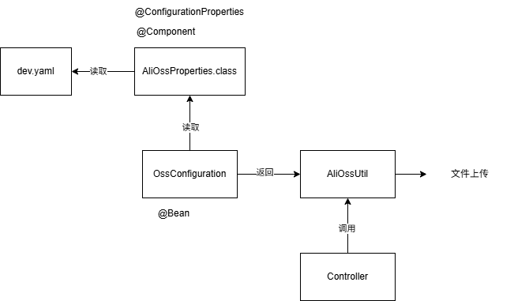

# 公共字段填充

在系统中的很多表中，都需要维护实体对象的公共字段，例如创建时间、修改时间、创建人、修改人等字段。将这一部分代码通过 AOP 抽象出来，进行面向切面编程，完成公共字段的自动填充，能让业务代码更简洁、清晰。

## 实现思路

涉及的字段以及操作类型如下：

| **序号** | **字段名**  | **含义** | **数据类型** | **操作类型**   |
| -------- | ----------- | -------- | ------------ | -------------- |
| 1        | create_time | 创建时间 | datetime     | insert         |
| 2        | create_user | 创建人id | bigint       | insert         |
| 3        | update_time | 修改时间 | datetime     | insert、update |
| 4        | update_user | 修改人id | bigint       | insert、update |

实现步骤：

1). 自定义注解 AutoFill，用于标识需要进行公共字段自动填充的方法，用来区分该方法的操作类型（属于插入还是更新）

2). 自定义切面类 AutoFillAspect，统一拦截加入了 AutoFill 注解的方法，通过反射为公共字段赋值

3). 在 Mapper 的方法上加入 AutoFill 注解

## 实现

1. 自定义注解 AutoFill

```java
/*
 * 自定义注解，用来标识方法需要进行哪种功能字段自动填充
 * */
@Target(ElementType.METHOD) //标注该注解用在方法上
@Retention(RetentionPolicy.RUNTIME) //标注该注解生效在运行时
public @interface AutoFill {
    // 枚举数据库操作类型：插入、新增
    OperationType value(); // 抽象到通用模块下的枚举包，值有插入和更新
}
```

2. 自定义切面类 AutoFillAspect

* 定义切人点：为 mapper 包下的加了 AutoFill 注解的所有方法
* 分析公共字段的注入应该在方法执行前，将公共字段注入实体对象，所以采用前置通知
* 通过 Spring 容器自动注入连接点（需要用注解 @Aspect 标注当前类是切面类）
* 获取到当前被拦截方法上的数据库操作类型（获取当前拦截方法签名对象 => 获取注解对象 => 调用方法获得操作类型）
* 通过反射为公共字段赋值（获取参数 => 拿到实体对象 => 根据插入或更新操作，通过反射拿到对应属性的 setter 方法 => 调用对应方法进行赋值）

```java
@Aspect
@Component
@Slf4j
public class AutoFillAspect {


    @Pointcut("execution(* com.sky.mapper.*.*(..)) && @annotation(com.sky.annotation.AutoFill)")
    public void autoFillPoinCut() {
    }

    // 前置通知
    @Before("autoFillPoinCut()")
    public void autoFill(JoinPoint joinPoint) {
        log.info("开始进行公共字段填充...");

        /*
        获取到当前被拦截方法上的数据库操作类型：
        1、获取当前方法签名对象
        2、获取注解对象
        3、获得注解对象中的值：拿到数据库操作类型
        * */
        // 1、获取当前方法签名对象
        // 这里由切入点定义的注解 annotation + AutoFill 注解中的target限制进来的一定是方法
        MethodSignature signature = (MethodSignature) joinPoint.getSignature();

        //2、通过方法签名对象拿到方法，进而获取注解对象
        AutoFill annotation = signature.getMethod().getAnnotation(AutoFill.class);

        // 3、获取注解中的值，拿到数据库操作类型
        OperationType operationType = annotation.value();

        /*通过反射为公共字段赋值
         * 1、拿到当前被拦截的方法的参数——实体对象
         * 2、准备数据
         * 3、根据当前操作的不同类型，拿到对应的属性的setter
         * 4、通过调用拿到的对应属性的 setter 进行赋值
         * */
        // 1、拿到实体对象:按照参数顺序
        Object[] args = joinPoint.getArgs();
        if (args == null || args.length == 0)
            return;
        Object entity = args[0];

        // 2、准备数据
        LocalDateTime now = LocalDateTime.now();
        Long id = BaseContext.getCurrentId();

        // 3、根据不同操作类型，通过反射拿到实体对象对应属性的setter
        if (operationType == OperationType.INSERT) {
            try {
                //拿到方法
                Method setCreateTime = entity.getClass().getDeclaredMethod(AutoFillConstant.SET_CREATE_TIME, LocalDateTime.class);
                Method setUpdateTime = entity.getClass().getDeclaredMethod(AutoFillConstant.SET_UPDATE_TIME, LocalDateTime.class);
                Method setCreateUser = entity.getClass().getDeclaredMethod(AutoFillConstant.SET_CREATE_USER, Long.class);
                Method setUpdateUser = entity.getClass().getDeclaredMethod(AutoFillConstant.SET_UPDATE_USER, Long.class);

                // 调用方法，进行赋值
                setCreateTime.invoke(entity, now);
                setUpdateTime.invoke(entity, now);
                setCreateUser.invoke(entity, id);
                setUpdateUser.invoke(entity, id);
            } catch (Exception ex) {
                ex.printStackTrace();
            }
        } else if (operationType == OperationType.UPDATE) {
            try {
                //拿到方法
                Method setUpdateTime = entity.getClass().getDeclaredMethod(AutoFillConstant.SET_UPDATE_TIME, LocalDateTime.class);
                Method setUpdateUser = entity.getClass().getDeclaredMethod(AutoFillConstant.SET_UPDATE_USER, Long.class);

                // 调用方法，进行赋值
                setUpdateTime.invoke(entity, now);
                setUpdateUser.invoke(entity, id);
            } catch (Exception ex) {
                ex.printStackTrace();
            }
        }

        log.info("公共字段填充完毕...");
    }
}
```

3. 在对应 Mapper 接口的方法上加入 AutoFill 注解

---------------

# 文件上传

文件上传，是指将本地图片、视频、音频等文件上传到服务器上，可以供其他用户浏览或下载的过程。

实现文件上传服务，需要有存储的支持，那么我们的解决方案将以下几种：

1. 直接将图片保存到服务的硬盘（SpringMVC 中的文件上传）

   优点：开发便捷，成本低

   缺点：扩容困难

2. 使用分布式文件系统进行存储（比如：FastDFS,MinIO）

   优点：容易实现扩容

   缺点：开发复杂度稍大

3. 使用第三方的存储服务（例如OSS）

   优点：开发简单，拥有强大功能，免维护

   缺点：付费

本次采用了阿里云的 OSS 服务进行文件存储，整体流程如下：


## 实现步骤

查询官方快速入门文档：

1. 创建有 OSS 管理权限的 RAM 用户 Accesskey
2. 配置 RAM 用户的 AccessKey 环境变量

```bash
# 设置环境变量
setx OSS_ACCESS_KEY_ID "YOUR_ACCESS_KEY_ID"
setx OSS_ACCESS_KEY_SECRET "YOUR_ACCESS_KEY_SECRET"

# 查看环境变量是否生效
echo %OSS_ACCESS_KEY_ID%
echo %OSS_ACCESS_KEY_SECRET%
```

3. 刷新或重启编译允许环境
4. 导入依赖

```xml
<dependency>
    <groupId>com.aliyun.oss</groupId>
    <artifactId>aliyun-sdk-oss</artifactId>
    <version>3.17.4</version>
</dependency>
```

5. OSS 完整使用流程：创建一个 Bucket、在服务端实现上传文件

* 在 yaml 文件中配置域名、环境变量 AccessKeyId 与 AccessKeySecret、bucket 名称
* 通过 @ConfigurationProperties 注入属性
* 创建 OSS 工具类，实现文件上传
* 通过配置类创建工具类对象，并交给 Spring 容器管理，实现自动注入
* 编写通用 Controller，接收上传的文件，通过调用 OSS 工具类实现文件上传

```java
//关键函数
// 存放的 bucketname，以及上传文件的文件名字 objectname，以及文件字节数组形式
ossClient.putObject(bucketName, objectName, new ByteArrayInputStream(bytes));

//调用上面的函数需要创建 OSSClient 对象，创建该对象需要 yaml 配置的属性信息
```

整体流程如下：



# 菜品管理模块

这个模块由于涉及多表操作需要注意：

* 对应的 DTO 以及 VO 的设计
* 事务控制
* 插入菜品时，通过 ` <insert id="insert" useGeneratedKeys="true" keyProperty="id">` 标签获取新插入的主键 id。
* 批量插入口味时，用到了标签：`<foreach collection="flavors" item="df" separator=",">`
* 删除菜品由于涉及多表，删除前需要检查逻辑外键，以及满足业务要求：起售中的菜品不能删，通过设计错误常量信息以及自定义异常完善功能。
* 修改菜品时，对于口味的修改简化为了删除，再插入

